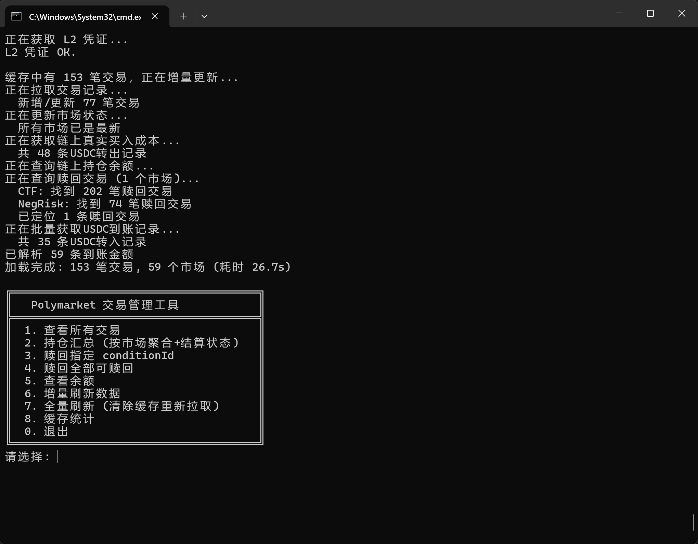

# PolyTradeManager

A command-line tool for managing your [Polymarket](https://polymarket.com/) trades on Polygon. Track positions, view P&L with on-chain cost verification, and batch-redeem settled markets — all from your terminal.



## Features

- **Trade History** — Fetch and browse all your Polymarket trades with pagination
- **Position Summary** — Aggregate trades by market, showing buy cost (on-chain USDC verified), sell proceeds, settlement outcome, and realized P&L
- **On-Chain Balance** — Query ERC-1155 CTF token balances directly from Polygon
- **Auto Redeem** — Redeem settled positions via CTF or NegRisk Adapter contracts, one-by-one or batch
- **USDC Tracking** — Reconcile actual USDC spent/received using Etherscan event logs
- **Local Cache** — SQLite-backed incremental cache for trades, markets, balances, redeems, and USDC transfers — fast startup after first sync
- **Incremental Sync** — Only fetches new trades and re-checks open markets on subsequent runs

## Prerequisites

- [.NET 9.0 SDK](https://dotnet.microsoft.com/download/dotnet/9.0)
- A Polygon wallet private key with Polymarket trading history
- An [Etherscan API key](https://etherscan.io/myapikey) (free tier works)
- (Optional) HTTP proxy for network access

## Setup

1. **Clone the repo**

   ```bash
   git clone https://github.com/yourname/PolyTradeManager.git
   cd PolyTradeManager
   ```

2. **Create a secrets file**

   Create `poly_secrets.txt` in the **parent directory** of the project (or in the build output directory):

   ```
   PRIVATE_KEY=0xYourPrivateKeyHere
   ETHERSCAN_API_KEY=YourEtherscanApiKey
   PROXY_URL=http://127.0.0.1:7890
   POLYGON_RPC=https://polygon-bor-rpc.publicnode.com
   ```

   > ⚠️ **Never commit this file.** Add it to `.gitignore`.

3. **Build & Run**

   ```bash
   dotnet run
   ```

## Usage

```
╔══════════════════════════════════════╗
║   Polymarket 交易管理工具            ║
╠══════════════════════════════════════╣
║  1. 查看所有交易                     ║
║  2. 持仓汇总 (按市场聚合+结算状态)   ║
║  3. 赎回指定 conditionId             ║
║  4. 赎回全部可赎回                   ║
║  5. 查看余额                         ║
║  6. 增量刷新数据                     ║
║  7. 全量刷新 (清除缓存重新拉取)      ║
║  8. 缓存统计                         ║
║  0. 退出                             ║
╚══════════════════════════════════════╝
```

### Key Workflows

- **First run** — Automatically fetches all trades, markets, on-chain balances, redeem transactions, and USDC transfer logs. Data is cached locally in SQLite.
- **Subsequent runs** — Incremental sync: only new trades and open markets are refreshed.
- **Position summary** — Shows per-market P&L with on-chain verified buy cost, sell proceeds, settlement result (win/lose), and actual USDC received from redeems.
- **Redeem** — Calls `redeemPositions` on the CTF contract (falls back to NegRisk Adapter if needed).

## Project Structure

```
PolyTradeManager/
├── Program.cs              # Main entry, CLI menu, all business logic
├── CacheDb.cs              # SQLite cache layer (trades, markets, balances, redeems, USDC transfers)
├── PolyTradeManager.csproj # Project file
└── poly_secrets.txt        # ⛔ Not committed — your private keys and API keys
```

## Dependencies

| Package | Purpose |
|---------|---------|
| [Polymarket.Net](https://www.nuget.org/packages/Polymarket.Net) | Polymarket CLOB & Gamma API client |
| [Nethereum.Web3](https://www.nuget.org/packages/Nethereum.Web3) | Polygon RPC, contract calls, transaction signing |
| [Newtonsoft.Json](https://www.nuget.org/packages/Newtonsoft.Json) | JSON serialization for cache |
| [Microsoft.Data.Sqlite](https://www.nuget.org/packages/Microsoft.Data.Sqlite) | Local SQLite cache |

## Security Notes

- **Private key** is loaded at runtime from an external file, never hardcoded in source.
- Contract addresses (CTF, NegRisk Adapter, USDC.e) are public on-chain constants.
- All Etherscan and RPC calls go through your configured proxy if set.

## License

MIT
